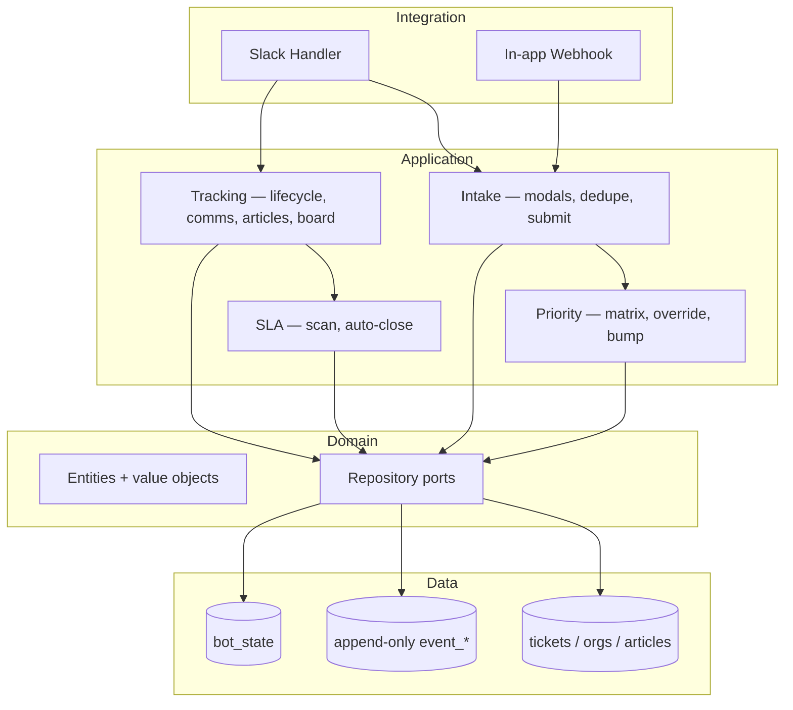

# Getting Started

## Prerequisites

- Python 3.14+
- [uv](https://docs.astral.sh/uv/) — fast Python package manager
- [just](https://github.com/casey/just) (optional) — task runner

## Installation

```sh
git clone git@github.com:Userled-Ryan/Customerbot.git
cd Customerbot

# Install dependencies and pre-commit hooks
just install
# or without just:
uv sync --dev && uv run pre-commit install
```

## Quick start

### 1. Create the Slack app

Follow [Slack Integration](integrations/slack.md). You'll get:

- `xoxb-…` bot token
- App signing secret
- Workspace URL

### 2. Configure credentials

```sh
cp .env.example .env
```

The minimum required keys to boot the bot are:

| Key | Why it's required |
|---|---|
| `CUSTOMERBOT_SLACK__BOT_TOKEN` | Without it, the bot can't authenticate to Slack |
| `CUSTOMERBOT_SLACK__SIGNING_SECRET` | Used to verify incoming Slack requests |
| `CUSTOMERBOT_SE_USER_ID` | The Solutions Engineer's Slack user ID — recipient of every draft DM |

Everything else gates a specific feature. See
[Configuration](configuration.md) for the full list; features whose
gates aren't set fail closed with a clear log line rather than crashing.

### 3. Run the server

```sh
just dev
# or:
uv run uvicorn customerbot.main:api --reload
```

The server starts on `http://localhost:8080`:

| Endpoint | Method | Description |
|---|---|---|
| `/slack/events` | POST | Slack event + interactive component subscription |
| `/webhooks/in-app-bug` | POST | Signed in-app bug submission (Chunk 14) |
| `/health` | GET | Liveness probe — returns `{"status": "healthy"}` |

Migrations run automatically on startup (Alembic). Background jobs
(SLA scan, auto-close, weekly digest, nudges, sweeper) spin up via the
FastAPI lifespan and shut down cleanly.

!!! tip "Local development with webhooks"
    Slack events and the in-app webhook both need a publicly reachable
    URL. [ngrok](https://ngrok.com/) or
    [cloudflared](https://developers.cloudflare.com/cloudflare-one/connections/connect-networks/)
    work well:

    ```sh
    ngrok http 8080
    ```

    Plug the resulting `https://<sub>.ngrok-free.app` into the Slack
    app's Event Subscriptions URL and Interactivity URL, and use it
    as the base for `/webhooks/in-app-bug`.

### 4. Seed the orgs (customer roster)

The bot won't show a usable intake modal until the `orgs` table has at
least one row — it's the source of the org dropdown. Each org carries a
name, a `slack_channel_id` **or** `teams_channel_id` (either may be
blank), a `csm_user_id`, and the priority-weighting inputs (`acv_tier`,
`sentiment`, `renewal_status`/`renewal_date`).

- **One org** — `scripts/seed_org.py`:

  ```sh
  uv run --no-sync python scripts/seed_org.py \
      --id acme --name "Acme Corp" --channel C0123ABCD --csm U0456 \
      --acv large --sentiment neutral --renewal stable
  ```

- **Bulk from CSV** — `scripts/import_orgs.py` (idempotent upsert by
  `id`; `--dry-run` previews). Required columns `id`,`name`; optional
  `slack_channel_id`,`teams_channel_id`,`csm_user_id`,`acv_tier`,
  `sentiment`,`renewal_status`,`renewal_date`. Unknown columns are
  ignored, so you can keep reference columns in the file.

  ```sh
  uv run --no-sync python scripts/import_orgs.py customers.csv --dry-run
  uv run --no-sync python scripts/import_orgs.py customers.csv
  ```

Set `csm_user_id` — it drives both the Awaiting-customer pre-close
nudges and the **Stakeholders** `@`-mention on every ticket card for
that org. `slack_channel_id` also feeds the channel→org cache that
powers the `log`/`check` customer-channel detector. An unmapped org_id
falls back to the catch-all `unknown` org, so seed that one too.

The legacy `/csbot org add` command still exists behind
`CUSTOMERBOT_LEGACY_COMMANDS_ENABLED=true`, but the scripts are the
supported path.

### 5. Run the four happy paths

Once the app is installed and at least one org is seeded, follow
[`docs/specs/smoke-test.md`](specs/smoke-test.md) to verify each
intake path end-to-end. The same four paths are covered by the
automated suite (`pytest`), but a manual smoke is the only thing
that catches Slack-scope misconfiguration.

## Development workflow

```sh
just check       # ruff lint + format-check + ty + import-linter + migration check
just test        # pytest
just lint-fix    # auto-fix lint issues
just format      # auto-format code
just docs        # mkdocs serve (this site, locally on :8000)
```

## Architecture



customerbot follows a clean / ports-and-adapters architecture, enforced
by `import-linter` (8 contracts, all kept):

- **Domain** — entities, value objects, repository ports. No vendor
  imports (no `slack_sdk`, no `sqlalchemy`, no `fastapi`).
- **Application** — use cases that orchestrate domain logic. Same
  vendor-free constraint.
- **Data** — SQLAlchemy + Alembic implementations of the repository
  ports.
- **Integration** — Slack handler (Bolt + slack_sdk) and the FastAPI
  webhook router. The only layer that touches HTTP / Slack SDKs.
- **Main** — boots FastAPI, wires the lifespan tasks, mounts routers.

### Startup behavior

1. **Run Alembic migrations** — schema is always at head; no manual
   step needed.
2. **Start the Slack integration** — registers slash commands, view
   handlers, action handlers.
3. **Mount the in-app webhook router** — `/webhooks/in-app-bug` is
   live.
4. **Spin up background tasks** — SLA scan, auto-close, nudges, weekly
   digest, sweeper, P0 scan, monthly matrix review.

## Database migrations

```sh
# Generate a new migration after a model change
uv run alembic revision --autogenerate -m "describe your change"

# Apply manually (rare — migrations run automatically on startup)
uv run alembic upgrade head

# Check current revision
uv run alembic current
```

At v1 the head revision is `0009_weekly_digest_state`. Every chunk of
the implementation plan that added storage shipped its own numbered
migration; the integration-test fixture applies them all on every
test run, so a green test suite proves Alembic compatibility.
