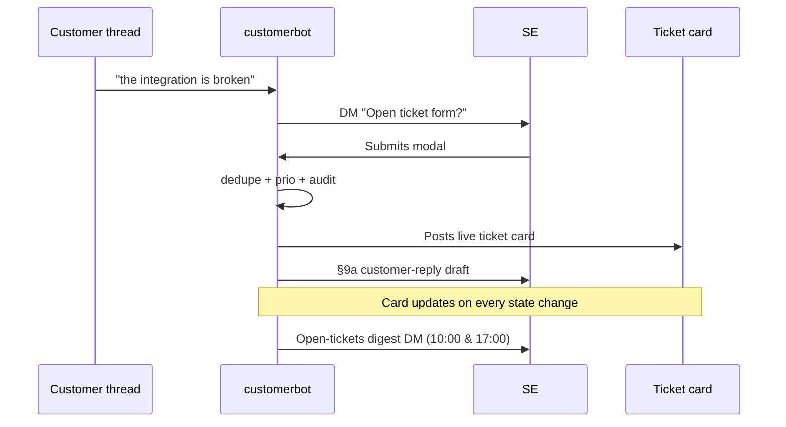

# customerbot

A Slack-resident bot that turns customer-surfaced queries into
structured tickets, drafts customer replies for the Solutions Engineer
(SE) to send, fires SLA alerts, and keeps a live "board" message
updated so the team can see what's open without asking.

## Two design rules everything else falls out of

1. **Bot suggests, human decides.** Every customer-facing message is
   drafted by the bot, every prio bump is a suggestion, every ticket
   form is pre-filled — but SE (or the CSM) clicks the button. The only
   thing the bot says to a customer is a short status line in the thread
   a ticket was raised from (logged / passed to engineering / resolved);
   it never DMs customers and never writes prose for the SE.
2. **Append-only event log.** Every state change writes a row to one of
   four `event_*` tables. Reporting metrics — reclassification rate,
   SLA breach rate, first-response time by tier — fall out of those
   rows for free.

## How it works

## Intake paths (four)

- **Customer-channel trigger** — an internal member typing `log` or
  `check` in a customer thread; the bot DMs them an **Open ticket
  form** card.
- **`/log` slash command** (shortcut `/l`) — opens the right modal
  based on the channel (CSM intake in `#tech-assistance`, SE bug elsewhere).
- **`@UserledSupport log this`** — manual override that opens the same
  pre-filled form as the detector.
- **In-app webhook** — `POST /webhooks/in-app-bug` with HMAC-SHA256
  signature; ticket created with `Source.IN_APP`, dedupe runs, feed
  entry posted to `#tech-assistance`.

## Ticket lifecycle

After creation, the **ticket card** in `SE_TICKETS_CHANNEL_ID` is the
live view. It re-renders on every state change. The card carries
two rows of buttons:

| Button | Effect |
|---|---|
| **Resolved** | → Awaiting customer · DMs §9c draft |
| **Resolved via hotfix** | Same + auto-creates underlying-bug ticket on Dev Action lane |
| **Move to Dev Action** | Flips lane · DMs the `@support` devs · records the dev owner and assigns them the Linear issue |
| **Reclassify** | Opens type / subtype / reason / next-step / owner modal |
| **Add affected org** | Org picker · re-runs multi-customer bump check |
| **Reopen** | Within 30d → In progress; older → DM suggests new linked ticket |
| **Set / Change deadline** | Datepicker; empty = clear |
| **Reply needed / Clear reply-needed** | Toggles the SE "waiting on a reply" flag · card badge · feeds the daily 5pm digest |
| **Needs article** *(FAQ only)* | Inserts article in `Suggested` state |

## Background jobs

| Job | Cadence | Responsibility |
|---|---|---|
| `SLAStateMachine` | 15 min | green → amber → red transitions; DM SE once per stage |
| `AutoCloseAwaiting` | daily | close after 7d in awaiting + CSM pre-close nudges |
| `ReplyNeededDigestJob` | 30 min poll | 17:00 SE-local: DM roll-up of tickets flagged "Reply needed" |
| `WeeklyDigestJob` | 30 min poll | Mondays 09:00 SE-local: counts / breach rate / oldest |
| `P0CandidateScan` | 30 min | ≥5 orgs hit a critical-path feature → flag SE + CTO |
| `MonthlyMatrixReview` | 5 min poll | 1st of month: DM SE to review the prio matrix |
| `SweepEphemeralState` | 1 min | drop 30-min-stale draft modals + 7d-stale pending rows |

## Next steps

-   :material-rocket-launch:{ .lg .middle } **Getting Started**

    ---

    Install customerbot, run it locally, hit the four intake paths.

    [:octicons-arrow-right-24: Getting started](getting-started.md)

-   :fontawesome-brands-slack:{ .lg .middle } **Slack Integration**

    ---

    Create the Slack app from the v1 manifest and install it.

    [:octicons-arrow-right-24: Slack setup](integrations/slack.md)

-   :material-cog:{ .lg .middle } **Configuration**

    ---

    Every `CUSTOMERBOT_*` environment variable and what it gates.

    [:octicons-arrow-right-24: Configuration](configuration.md)

-   :material-console:{ .lg .middle } **Commands**

    ---

    Slash commands and ticket-card buttons.

    [:octicons-arrow-right-24: Commands](commands.md)

-   :material-rocket:{ .lg .middle } **Deployment**

    ---

    Fly.io recipe + production checklist.

    [:octicons-arrow-right-24: Deployment](deployment.md)

